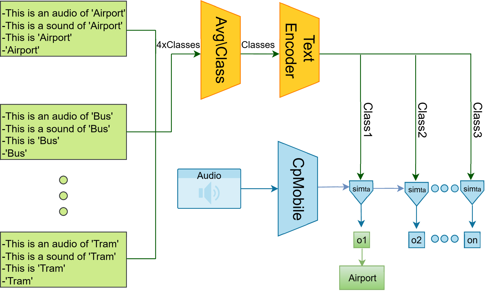

# CP-CLAP: Compact Language–Audio Alignment for Efficient Knowledge Transfer

CP-CLAP is a lightweight multimodal audio-classification framework that preserves the semantic supervision of contrastive language–audio learning while replacing the conventional high-cost audio encoder with a compact CP-Mobile encoder.

The design has two goals:

- retain strong **audio–text semantic alignment**
- reduce the **parameter count, computation, training time, memory use, and inference latency** of the audio pathway

The resulting model can operate as a strong standalone audio–text classifier and, more importantly, as a **high-value heterogeneous teacher** for compact student models.

## Key Results

| Result | Value |
|---|---:|
| CP-CLAP accuracy on TAU | **57.0%** |
| Original CLAP accuracy on TAU | 57.2% |
| CP-CLAP audio-encoder parameters | **0.29M** |
| CP-CLAP audio-encoder MACs / sample | **0.37G** |
| CP-CLAP training time | **1.05 h** |
| CP-CLAP latency / batch | **4.66 ms** |
| Contribution to ensemble accuracy | **+2.25%** |
| Student gain from including CP-CLAP on TAU | **~+0.8 percentage points** |

CP-CLAP remains extremely close to the original CLAP configuration in accuracy while replacing its audio encoder with a dramatically smaller alternative. In the reported TAU comparison, accuracy changes only from **57.2% to 57.0%**, while the audio encoder drops from **27.5M to 0.29M parameters** and from **59.14G to 0.37G MACs per sample**.

---

# Overview

Contrastive language–audio models learn a shared representation space in which an audio embedding can be compared directly with semantic text embeddings.

This is powerful because classification is no longer based only on a conventional learned classifier. Instead, the audio representation can be matched against textual descriptions of the target classes.

The main problem is efficiency.

A conventional CLAP audio encoder is expensive for repeated training, teacher ensembling, and low-resource deployment. CP-CLAP addresses this by retaining the language-guided semantic structure while replacing the original audio encoder with **CP-Mobile**.

The resulting structure is:

- **CP-Mobile** for efficient audio representation learning
- a **CLAP text encoder** for semantic class representations
- multiple text prompts per class
- class-wise prompt averaging
- normalized audio–text similarity
- bidirectional contrastive alignment
- direct class-level semantic supervision

This provides a compact audio pathway without discarding the multimodal information that makes CLAP useful as a teacher.

---

# CP-CLAP Architecture



The architecture has two parallel branches.

## Audio Branch

The input audio is converted to its acoustic representation and processed by the **CP-Mobile audio encoder**.

For an input sample, the audio encoder produces an embedding:

$$a^i \in \mathbb{R}^{d}$$

The embedding is normalized before similarity computation.

Replacing the original CLAP audio encoder with CP-Mobile is the main source of the computational reduction.

---

## Text Branch

Instead of representing each class with only one prompt, CP-CLAP constructs **four textual descriptions for every class**:

- `this is an audio of [class]`
- `[class]`
- `this is [class]`
- `this is a sound of [class]`

Each prompt is processed by the text encoder.

For class $c$, let the four text representations be:

$$t_{c,1},t_{c,2},t_{c,3},t_{c,4}$$

The class representation is obtained by averaging the four prompt embeddings:

$$t_c = \frac{1}{4}\sum_{m=1}^{4}t_{c,m}$$

Prompt averaging reduces dependence on a particular wording and produces a more stable semantic representation for each acoustic class.

---

# Audio–Text Matching

After encoding the audio and constructing the class-level text embeddings, CP-CLAP compares the audio representation with every class representation.

For normalized audio and text vectors, the audio–text similarity is:

$$\mathrm{sim}_{ta}(a_n,t_n) = \left(a_n^{T}t_n\right)\exp(\tau_{ta})$$

where $\tau_{ta}$ is a learnable temperature parameter.

The model therefore assigns a class by measuring how strongly the audio embedding aligns with the semantic representation of each candidate class.

Conceptually:

**audio → CP-Mobile embedding → similarity with all class text embeddings → class prediction**

This allows a compact convolutional encoder to benefit from semantic supervision normally associated with much larger audio–language models.

---

# CP-CLAP Training Objective

CP-CLAP is trained using a composite objective that combines:

1. audio-to-text contrastive alignment
2. text-to-audio contrastive alignment
3. class-level semantic classification

The complete objective is:

$$L_{\mathrm{cpcl}} = \alpha\left(\beta L_{a2t} + (1-\beta)L_{t2a}\right) + (1-\alpha)L_{\mathrm{cls}}$$

The reported configuration uses:

$$\alpha = 0.5$$

$$\beta = 0.5$$

Here:

- $\alpha$ balances contrastive alignment against direct classification
- $\beta$ balances audio-to-text and text-to-audio alignment
- $L_{\mathrm{cls}}$ directly encourages the audio embedding to align with the correct semantic class

---

# Audio-to-Text Alignment

For a batch containing $N$ audio samples and $C$ target classes, the audio-to-text loss encourages each audio sample to be closer to its correct class text embedding than to the other class embeddings.

$$L_{a2t} = -\frac{1}{N}\sum_{j=1}^{N}\log\frac{\exp\left(\mathrm{sim}_{ta}\left(a^j,t_{\mathrm{class}(a^j)}\right)\right)}{\sum_{i=1}^{C}\exp\left(\mathrm{sim}_{ta}\left(a^j,t_i\right)\right)}$$

For every audio sample:

- the numerator measures similarity to the correct semantic class
- the denominator compares that sample against all class representations

The objective therefore pulls each audio embedding toward the correct text embedding while pushing it away from competing classes.

---

# Text-to-Audio Alignment

The reverse direction aligns every class representation with the corresponding audio distribution.

For class $c$, the mean audio embedding is:

$$\bar{a}_c = \frac{\sum_{i=1}^{N}a^i\mathbf{1}_{\{\mathrm{class}(a^i)=c\}}}{\sum_{i=1}^{N}\mathbf{1}_{\{\mathrm{class}(a^i)=c\}}}$$

The text-to-audio objective is:

$$L_{t2a} = -\frac{1}{C}\sum_{j=1}^{C}\log\frac{\exp\left(\mathrm{sim}_{ta}\left(\bar{a}_j,t_j\right)\right)}{\sum_{i=1}^{N}\exp\left(\mathrm{sim}_{ta}\left(a^i,t_j\right)\right)}$$

This provides the complementary direction of contrastive learning.

Instead of only asking whether an audio sample maps to the correct text class, the model also learns whether a semantic class representation maps back toward the correct audio examples.

---

# Semantic Classification Loss

A direct class-level objective is included alongside the bidirectional contrastive terms.

$$L_{\mathrm{cls}} = -\frac{1}{N}\sum_{i=1}^{N}\log\frac{\exp\left(\mathrm{sim}_{cls}\left(a^i,t_{\mathrm{clap},\mathrm{class}(a^i)}\right)\right)}{\sum_{j}\exp\left(\mathrm{sim}_{cls}\left(a^i,t_{\mathrm{clap},j}\right)\right)}$$

The classification similarity uses the same normalized dot-product principle:

$$\mathrm{sim}_{cls}(a_n,t_n) = \left(a_n^{T}t_n\right)\exp(\tau_{cls})$$

where $\tau_{cls}$ is learned independently from $\tau_{ta}$.

The contrastive terms organize the shared audio–text embedding space, while the classification term explicitly strengthens separation between target classes.

---

# Why the Combined Objective Works

The three terms provide complementary supervision.

## Audio-to-Text

Encourages every audio sample to identify its correct semantic class.

## Text-to-Audio

Encourages every semantic class representation to remain aligned with the corresponding audio distribution.

## Classification

Directly optimizes discriminative class identification.

The full objective therefore learns a representation that is simultaneously:

- semantically meaningful
- discriminative
- bidirectionally aligned
- suitable for teacher supervision

---

# Comparable Accuracy at a Fraction of the Cost

A major result of CP-CLAP is that the lightweight audio encoder preserves essentially the same classification accuracy as the original CLAP configuration while dramatically reducing computational requirements.

| Audio Encoder | Accuracy | Train Time | Params | MACs / Sample | Latency / Batch | Peak GPU |
|---|---:|---:|---:|---:|---:|---:|
| Original CLAP | 57.2% | 11.55 h | 27.5M | 59.14G | 206.8 ms | 2836 MB |
| **CP-CLAP** | **57.0%** | **1.05 h** | **0.29M** | **0.37G** | **4.66 ms** | **661 MB** |

The accuracy difference is only **0.2 percentage points**, while CP-CLAP provides approximately:

- **95× fewer audio-encoder parameters**
- **160× fewer MACs per sample**
- **11× shorter training time**
- **44× lower batch latency**
- **4.3× lower peak GPU memory**

This makes the multimodal teacher much more practical for repeated experimentation and multi-teacher distillation.

Across the downstream audio benchmarks used in this project, CP-CLAP also remains a strong standalone teacher, demonstrating that the lightweight audio branch can retain useful CLAP-style semantic supervision without requiring the original high-cost audio encoder.

---

# CP-Mobile + CLAP Results

The benefit of semantic audio–text supervision is also visible when CP-CLAP is compared with successive CP-Mobile configurations on TAU.

| Device | CP-Mobile V1 | CP-Mobile V2 | CP-Mobile V3 | **CP-CLAP** |
|---|---:|---:|---:|---:|
| A | 57.3 | 62.7 | 62.7 | **64.8** |
| B | 50.3 | 55.0 | 56.7 | **58.5** |
| C | 53.8 | 56.3 | **59.9** | 59.1 |
| S1 | 49.1 | 51.7 | 51.0 | **54.5** |
| S2 | 48.0 | 51.1 | 51.9 | **53.2** |
| S3 | 53.0 | 56.1 | 57.0 | **57.8** |
| **Overall** | 50.8 | 54.3 | 55.3 | **57.0** |

CP-CLAP improves the overall CP-Mobile result from **55.3% to 57.0%** relative to the strongest non-CLAP CP-Mobile configuration in this comparison.

The improvement is especially clear across several real and simulated recording-device conditions, indicating that semantic text supervision provides useful information beyond the original compact audio classifier.

---

# CP-CLAP as a Heterogeneous Teacher

CP-CLAP is particularly valuable when used as part of a teacher ensemble.

A strong ensemble benefits when its members make decisions using **different representations and inductive biases**.

CP-CLAP is architecturally different from purely convolutional and transformer-only audio teachers because its predictions are shaped by an explicit **audio–language embedding space**.

This diversity is useful for knowledge distillation:

- CNN teachers emphasize local acoustic patterns
- transformer teachers capture longer-range structure
- CP-CLAP contributes semantic audio–text alignment
- the final ensemble combines these complementary views

The measured teacher results are:

| Dataset | LEN v1 | LEN v2 | CP-Mobile | CP-ResNet | HTS-AT | **CP-CLAP** | **Ensemble** |
|---|---:|---:|---:|---:|---:|---:|---:|
| TAU | 57.1 | 55.8 | 54.3 | 51.9 | 52.1 | **57.0** | **63.6** |
| ESC-50 | 87.2 | 85.0 | 87.9 | 87.6 | 91.5 | **94.7** | **96.6** |
| FSD50K | 58.4 | 58.0 | 61.8 | 59.4 | 64.3 | **66.4** | **67.2** |
| UrbanSound8K | 92.1 | 89.3 | 91.2 | 90.0 | **95.8** | 94.3 | **98.9** |

> FSD50K values are mAP; the other datasets report classification accuracy.

CP-CLAP is one of the strongest individual teachers across the evaluated tasks. It reaches **94.7% on ESC-50**, **66.4% mAP on FSD50K**, and **94.3% on UrbanSound8K**, while providing a semantic representation that differs substantially from the other ensemble members.

The reported ensemble study found that including CP-CLAP adds **+2.25% to ensemble accuracy**.

---

# Knowledge Transfer to the Compact Student

CP-CLAP is used as an external teacher for the previously designed compact student.

The student itself remains lightweight. The expensive multimodal components are only required during training.

Because CP-CLAP is both **high-performing** and **architecturally heterogeneous**, it contributes information that is difficult to obtain from another student-like CNN alone. Its text-aligned decision structure enriches the teacher distribution used during knowledge distillation.

The effect is measurable:

> Removing CP-CLAP from student training reduces TAU student accuracy by approximately **0.8 percentage points**.

Equivalently, including CP-CLAP contributes approximately **+0.8 percentage points** to the final TAU student result under the reported training setup.

This gain is obtained **without increasing the deployed student's architecture or inference cost**.

---

# Inner–Outer Training Pipeline

The compact student is trained using an **inner–outer knowledge-transfer pipeline**.

The inner stage first develops the student using a structurally related teacher and intermediate representation supervision. The outer stage then introduces the heterogeneous external teacher ensemble, including CP-CLAP, to refine the student's output distribution.

The purpose of the outer stage is to transfer complementary high-level knowledge after the compact student already has a strong representation.

CP-CLAP participates in this outer teacher set as the multimodal semantic teacher.

---

# Student Progression

The effect of the inner–outer training strategy is shown below.

| Dataset | Inner Teacher | Student from Scratch | Student + Inner KD | Student + Outer KD | **Full Student** |
|---|---:|---:|---:|---:|---:|
| TAU | 58.1 | 54.1 | 57.1 | 58.9 | **60.0** |
| ESC-50 | 87.6 | 86.7 | 87.4 | 90.0 | **92.0** |
| FSD50K | 56.5 | 52.0 | 56.1 | 57.7 | **58.7** |
| UrbanSound8K | 92.2 | 87.6 | 92.0 | 96.1 | **97.4** |

> FSD50K reports mAP; the remaining datasets report accuracy.

The final model consistently improves over both the scratch-trained student and the intermediate distillation stages.

---

# Student Complexity

The final student keeps the same inference architecture as the student trained from scratch.

| Dataset | Student MMACs | Parameters | Model Size |
|---|---:|---:|---:|
| TAU | **19.6** | **31.2K** | **59.6 KB** |
| ESC-50 | **98.3** | **36.4K** | **69.7 KB** |
| FSD50K | **156.8** | **55.7K** | **107.5 KB** |
| UrbanSound8K | **78.4** | **31.2K** | **59.6 KB** |

This is the central deployment advantage of using CP-CLAP as a teacher: multimodal semantic knowledge is used during training, but the final deployed model remains extremely small.

---

# Final Results

## TAU Urban Acoustic Scenes

| Model | Accuracy | Parameters | Precision |
|---|---:|---:|---:|
| Baseline | 50.3% | 61K | 16-bit |
| CR_B_CPM | 57.5% | 61K | 16-bit |
| TFSN | 57.9% | 126K | 32-bit |
| Linear_c | 59.1% | 63K | 16-bit |
| NEPUMSE | 59.7% | 107K | 32-bit |
| **Compact student** | **60.0%** | **31K** | **16-bit** |

The compact student reaches **60.0% accuracy with only 31K parameters**.

---

## ESC-50

| Model | Accuracy | Parameters |
|---|---:|---:|
| MSM-MAE | 85.6% | 86M |
| AclNet | 85.65% | 155K |
| SS-AST | 88.8% | 90M |
| SacNet | 93.1% | 90M |
| ResNet38 | 94.7% | 73M |
| BEATs iter3 | 95.6% | 300M |
| CLAP | 96.7% | 190.8M |
| M2D-CLAP | **97.9%** | 149M |
| **Compact student** | **92.0%** | **36K** |
| **350K student** | **94.8%** | **350K** |

The compact configuration reaches **92.0% with only 36K parameters**, while the higher-capacity 350K configuration reaches **94.8%**.

---

## FSD50K

| Model | mAP | Parameters |
|---|---:|---:|
| ATST-Frame | 55.1% | 22M |
| MATPAC++ | 56.1% | 86M |
| PSLA | 56.71% | 18M |
| ATST-Clip | 58.5% | 86M |
| DyMN-L | 65.5% | 40M |
| PaSST-S | 65.55% | 86M |
| MN | 65.6% | 68M |
| ONE-PEACE | **69.7%** | 1.72B |
| **Compact student** | **58.7%** | **55K** |
| **350K student** | **64.0%** | **350K** |

The compact student reaches **58.7% mAP with only 55K parameters**.

---

## UrbanSound8K

| Model | Accuracy | Parameters |
|---|---:|---:|
| MAE-AST | 82.6% | 80M |
| Dasheng 0.6B | 85.6% | 600M |
| M2D-CLAP | 88.5% | 149M |
| MATPAC | 89.7% | 86M |
| AudioCLIP | 90.7% | 30M |
| MFR + GoogleNet | 94.2% | 7M |
| ITFA-DNN | 95.3% | 2M |
| **Compact student** | **97.4%** | **31K** |

The final compact student reaches **97.4% accuracy with only 31K parameters**.

---

# Why CP-CLAP Matters

CP-CLAP addresses two different efficiency problems at once.

## Efficient Multimodal Training

Replacing the conventional audio encoder with CP-Mobile reduces the cost of training and evaluating the multimodal model while preserving almost identical measured accuracy in the direct CLAP comparison.

## Stronger Knowledge Distillation

CP-CLAP is not merely another audio classifier.

Its predictions are shaped by explicit semantic text alignment, so it introduces a different decision geometry into the teacher ensemble.

This architectural diversity makes it particularly useful for knowledge transfer.

## No Multimodal Cost at Deployment

The text encoder, CP-CLAP model, and the rest of the teacher ensemble are training-time components.

After distillation, deployment uses only the compact student.

---

# Final Summary

CP-CLAP combines:

- a lightweight **CP-Mobile audio encoder**
- CLAP-style **semantic text representations**
- four-prompt class averaging
- normalized audio–text similarity
- audio-to-text contrastive learning
- text-to-audio contrastive learning
- semantic classification supervision
- heterogeneous teacher ensembling
- inner–outer knowledge transfer

The direct CLAP comparison is:

| Configuration | Accuracy | Audio Params | MACs / Sample | Training Time | Batch Latency |
|---|---:|---:|---:|---:|---:|
| Original CLAP | 57.2% | 27.5M | 59.14G | 11.55 h | 206.8 ms |
| **CP-CLAP** | **57.0%** | **0.29M** | **0.37G** | **1.05 h** | **4.66 ms** |

CP-CLAP therefore preserves comparable accuracy while using a drastically smaller and faster audio encoder.

When incorporated into the heterogeneous teacher ensemble, it contributes **+2.25% to ensemble accuracy**. When removed from compact-student training, TAU accuracy falls by approximately **0.8 percentage points**, demonstrating that its semantic and architectural diversity provides meaningful knowledge beyond the other teachers.

The final distilled student reaches:

| Dataset | Final Result | Parameters |
|---|---:|---:|
| **TAU** | **60.0% accuracy** | **31.2K** |
| **ESC-50** | **92.0% accuracy** | **36.4K** |
| **FSD50K** | **58.7% mAP** | **55.7K** |
| **UrbanSound8K** | **97.4% accuracy** | **31.2K** |

The result is a practical path for transferring the semantic strength of audio–language models into extremely compact audio classifiers without carrying multimodal inference cost into deployment.

---

# Code Structure

The repository is organized to keep the **CP-CLAP model**, **training pipeline**, **knowledge distillation**, and shared audio-processing utilities clearly separated.

```text
CP-Clap/
├── checkpoints/          # Model checkpoint placeholders
├── distillation/         # Knowledge-distillation utilities and losses
├── evaluation/           # Evaluation and metric helpers
├── models/               # CP-CLAP and supporting model definitions
├── training/             # CP-CLAP and student training logic
│
├── __init__.py           # Package initialization
├── api.py                # High-level package interface
├── augmentations.py      # Audio augmentation utilities
├── batches.py            # Batch preparation and data helpers
├── checkpoints.py        # Checkpoint loading and saving utilities
├── config.py             # Shared configuration and hyperparameters
├── external.py           # External model and component integration
├── spectrum.py           # Spectrogram and audio feature processing
└── CPCLAP_STRUCTURE.txt  # Additional notes about the package layout
